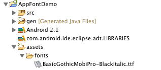
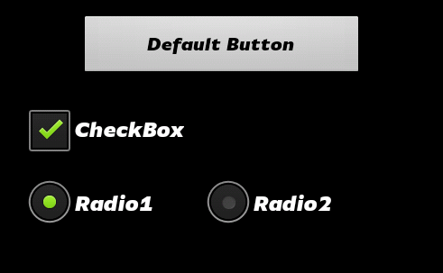
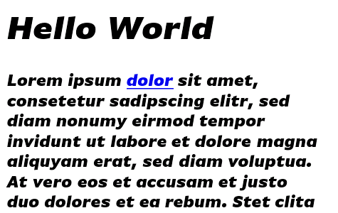

Android Font Demo
================= 

This sample code illustrates the usage of custom mobile fonts on the Android platform. Applications that want to use custom fonts simply include those fonts in their assets folder.

The following examples all use the free FontFont FF Basic Gothic Black Italic (Truetype).

Basics
------

Create a 'fonts' folder in your *assets* folder. Copy the font files into that folder:

The font format can be either Truetype (\*.ttf) or OpenType (\*.otf).

Now we can get a [Typeface](http://developer.android.com/reference/android/graphics/Typeface.html) (the Android font class) reference like this:

    Typeface myFont = Typeface.createFromAsset(getAssets(),
    	"fonts/BasicGothicMobiPro-BlackItalic.ttf");

You can iteratively initialize all fonts in '*assets/fonts*' like this:

    for (String filename : getAssets().list("fonts")) {
    	Typeface myFont = Typeface.createFromAsset(getAssets(), "fonts/" + filename);
    	...
    }

See [Android Typeface API](http://developer.android.com/reference/android/graphics/Typeface.html) for further information on the Typeface class.

Text based controls (TextViews, EditTexts, Buttons etc.)
--------------------------------------------------------

Given the font reference, you can set the typeface property of all controls that are subclasses of [TextView](http://developer.android.com/reference/android/widget/TextView.html) (basically all controls that have some kind of text in them).

    myTextView.setTypeface(myFont);

Or, more generically (e.g. when you are iterating over all child views of a layout):

    if (TextView.class.isAssignableFrom(myView.getClass())) {
    	((TextView) myView).setTypeface(myFont);
    }

(See *TextViewDemoActivity* for an actual implementation).

We can even implement a dedicated 'Font Setter' that encapsulates those ideas and recursively sets a Typeface for a layout and all its sublayouts, as we demonstrate with *TypefaceSetter* in *ButtonDemoActivity*:

    LinearLayout layout = (LinearLayout) findViewById(R.id.buttonDemoLayout);
    TypefaceSetter.setTypeface(layout, myFont);

Title bars
----------

We need to check if title bar customization is available (specifically, in the activity's [onCreate](http://developer.android.com/reference/android/app/Activity.html#onCreate(android.os.Bundle\))) method, **before** interfering with the Layout):

    public void onCreate(Bundle savedInstanceState) {
    	super.onCreate(savedInstanceState);
    	final boolean customTitleSupported = requestWindowFeature(Window.FEATURE_CUSTOM_TITLE);
    	setContentView(R.layout.main);
    	...

Then we can go ahead and customize the titlebar with a custom layout and set a typeface:

    	if (customTitleSupported) {
    		getWindow().setFeatureInt(Window.FEATURE_CUSTOM_TITLE,
    				R.layout.sampleheader);
    		TextView myTitleText = (TextView) findViewById(R.id.mainTitleText);
    		myTitleText.setTypeface(myFont);
    	}

List views
----------

We need to implement a custom [Adapter](http://developer.android.com/reference/android/widget/Adapter.html) to assign the Typeface to list items when they are generated. Look into the sample implementation *CustomFontArrayAdapter*.

Then we use it like this:

    String [] menuItems = { ... };
    ListView lv = (ListView) findViewById( ... );
    lv.setAdapter(new CustomFontArrayAdapter<String>(this,
    	R.layout.standard_list_item, menuItems, myFont));

Web Views
---------

You can use your mobile fonts for local [WebView](http://developer.android.com/reference/android/webkit/WebView.html) based views as well. Let's say you put test.html in your *assets* folder like this:

The html file (or its CSS file) should declare the @font-face style property as follows:

    @font-face {
        font-family: 'BasicGothicMobiProBlack';
        src: url('fonts/BasicGothicMobiPro-BlackItalic.ttf');
    }
    body {
        font-family: 'BasicGothicMobiProBlack';
    }

Now you can load the local HTML file into a WebView (your app doesn't need special permissions for that):

    WebView mWebView = ...
    mWebView.loadUrl("file:///android_asset/test.html");

Apparently the support for embedded fonts for WebView is broken from Android 2.0 to 2.1 (1.6 and versions from 2.2 upwards support it again, see [Bugreport](http://code.google.com/p/android/issues/detail?id=4448))

How to get fonts
----------------

Fonts can be found all over the web, but be aware that licensing terms for professional typefaces often forbid embedding them into them apps. Shameless plug: For the best selection of fonts _IN THE WORLD_, head over to the [Mobile FontFonts](http://mobilefontfonts.com/) website, part of the [FontShop](http://www.fontshop.com/) empire.

